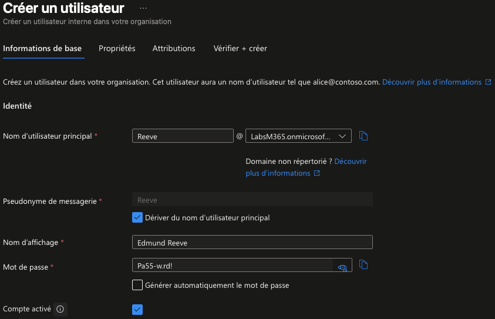
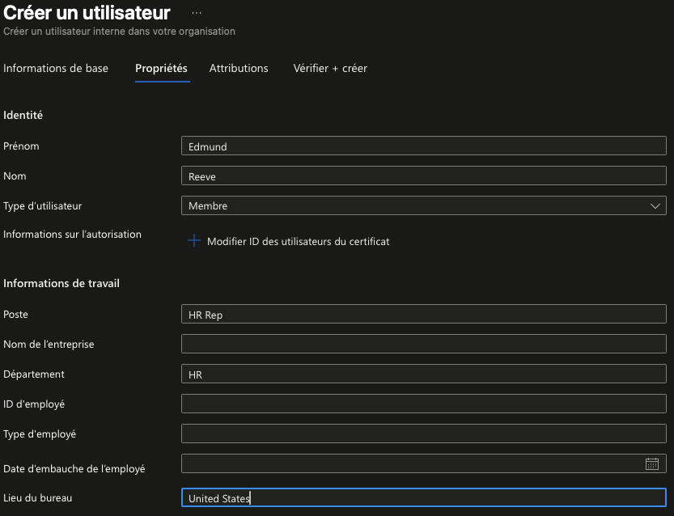

# Practice Lab 0101: Managing Identities in Entra ID

##  Exercise 1: Creating users in Entra ID
🎯 Objectif

Créer des comptes utilisateurs directement dans Microsoft Entra ID via le portail d’administration.

| Name            | User Name                          | Password  | Job title          | Department |
|-----------------|------------------------------------|-----------|--------------------|------------|
| Edmund Reeve    | ereeve@yourtenant.onmicrosoft.com  | Pa55-w.rd! | HR Rep             | HR         |
| Miranda Snider  | msnider@yourtenant.onmicrosoft.com | Pa55-w.rd! | Helpdesk Manager   | Operations |
| Cody Godinez    | cgodinez@yourtenant.onmicrosoft.com | Pa55-w.rd!  | Sales Rep          | Sales      |

1. Connexion au Microsoft Entra Admin Center
👉 https://entra.microsoft.com

(Compte administrateur)

2. Accès au menu Users > All users
   

Création d’un nouvel utilisateur

Type : Member

Mot de passe défini manuellement

Renseignements : nom, fonction, département

Usage location : United States

Aucune affectation de groupes ou rôles
(Configuration par défaut)

Vérification et validation de la création
(Captura de la verificacion de la creacion de los usuarios)

## Tâche 2 – Création d’utilisateurs avec PowerShell (Microsoft Graph)
🎯 Objectif

Créer un utilisateur Microsoft Entra ID via PowerShell 7 en utilisant le module Microsoft Graph.

1. Connexion au tenant
(Captura de la conexion al Tenant)
2. Création du profil mot de passe
(Captura de la creacion de usuarios)
3. Création de l’utilisateur Cody Godinez
(Captura con los datos del usuario Cody Godinez)
4. Vérification
 (Captura de la verificacion de la creacion)

## Exercise 2 – Attribution des rôles administratifs dans Microsoft Entra ID

🎯 Objectif

Analyser et attribuer des rôles administratifs aux utilisateurs du tenant Microsoft Entra ID selon leurs responsabilités.

| Nom             | Responsabilités principales              | Rôle administratif            |
|-----------------|------------------------------------------|-------------------------------|
| Allan Deyoung   | Gestion complète du tenant               | **Global Administrator**      |
| Edmund Reeve    | Gestion des utilisateurs et des groupes  | **User Administrator**        |
| Miranda Snider  | Réinitialisation des mots de passe       | **Helpdesk Administrator**    |

1. Accès à la gestion des rôles
2. (Captura dentro de la pantalla donde puedes editar los roles)
3. Attribution du rôle Global Administrator au Allan Deyoung
   (Captura añadiendo el role global)
5. Attribution du rôle User Administrator au Edmund Reeve
6. (Captura del role añadido)
7. Attribution du rôle Helpdesk Administrator au Miranda Snider

## Exercise 3: Creating and managing groups and validating license assignment
### Scénario - Attribution des groupes et des licences.
| Name            | Member of          | License to assign                                                                 |
|-----------------|--------------------|-----------------------------------------------------------------------------------|
| Edmund Reeve    | Contoso_Managers   | Office 365 E5 + EMS E5 (**group-based licensing**)                                 |
| Miranda Snider  | Contoso_Managers   | Office 365 E5 + EMS E5 (**group-based licensing**)                                 |
| Cody Godinez    | Contoso_Sales      | Office 365 E5 + EMS E5 (**direct assignment**)                                     |

### Task 1 – Création d’un groupe de sécurité dans Microsoft Entra ID
🎯 Objectif

Créer un groupe de sécurité et y ajouter des utilisateurs via le portail Microsoft Entra.

Accéder au Microsoft Entra Admin Center
👉 Groups

Sélectionner New group

Configurer le groupe :

Group type : Security

Group name : Contoso_Managers

Membership type : Assigned

Ajouter les membres :

Edmund Reeve

Miranda Snider

Sélectionner Create

### Task 2 – Création d’un groupe et ajout d’un membre via PowerShell

🎯 Objectif

Créer un groupe de sécurité et ajouter un utilisateur à l’aide de PowerShell 7 et du module Microsoft Graph.

1. Création du groupe de sécurité.
2. (Captura de creacion de grupo de seguridad)
3. Vérification de la créatrion du groupe.
4. (Captura del grupo ya he creado)
6. Définition des variables.
   (Captura de definition des variables)
8. Ajout de l'utilisateur au groupe
      (Añadir usuarios al grupo)
10. Vérification de l'appartenance au groupe.
    (Captura de los grupos ya creados con los usuarios.)

